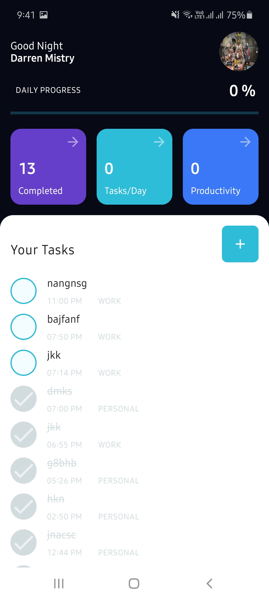
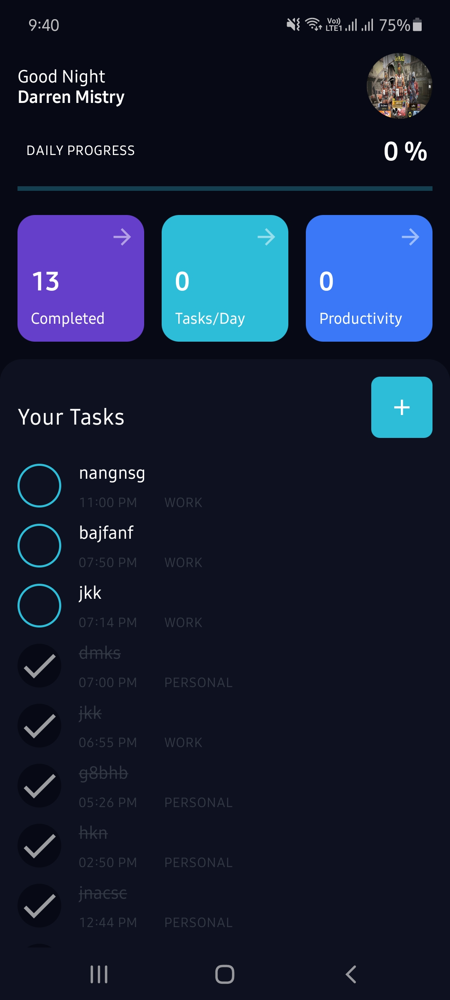
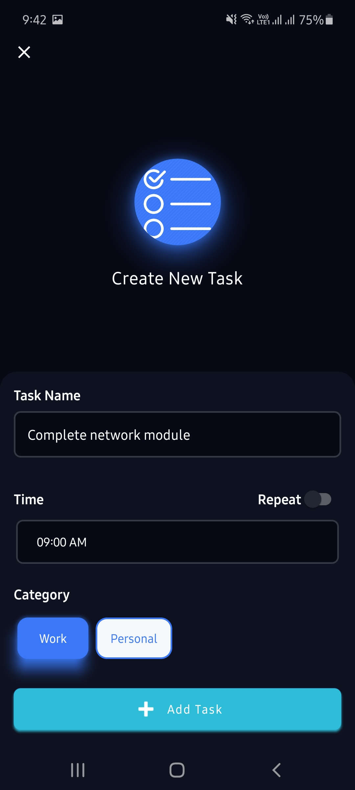
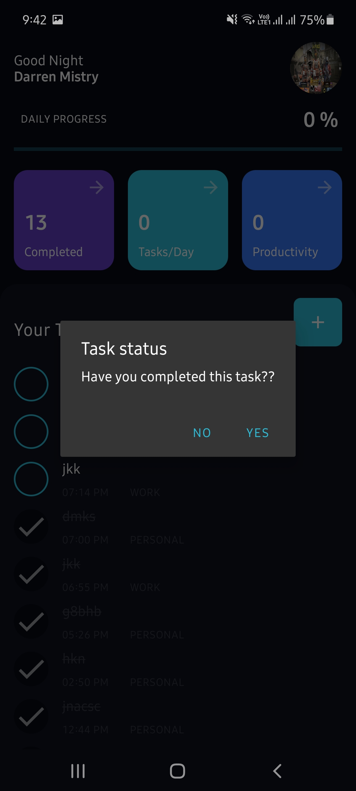
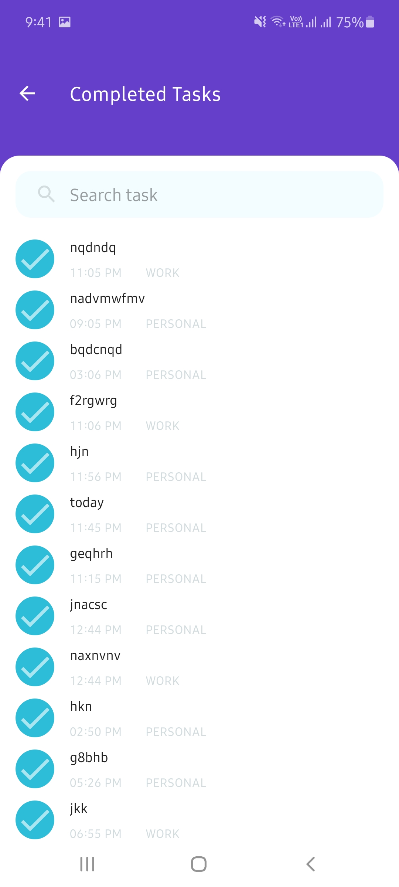
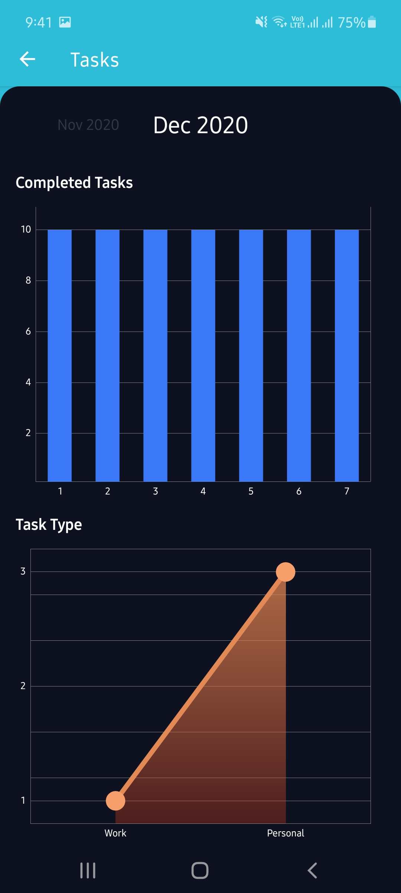

# daily-tasks

Android application to save your todo tasks, get reminders and view various statistics. Made completely in Kotlin using MVVM architecture. Dark mode support added using material design concepts and project structure. UX credits: https://dribbble.com/shots/11133876-Daily-Task-Dark-UI-Omnicreativora

## Outputs

| | | |
|:-------------------------:|:-------------------------:|:-------------------------:|
 Attractive UI design implemented |  Dark mode UI implementation using Material Design |
| Create tasks to do so you never forget |  Mark tasks as completed when done |
|  Search completed tasks |  View various kind of detailed statistics
